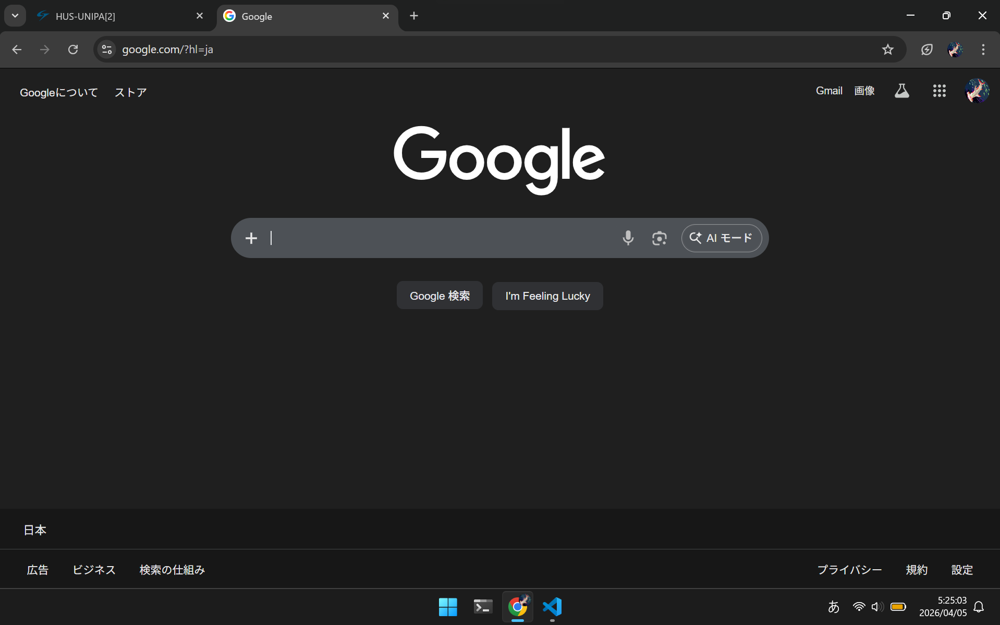
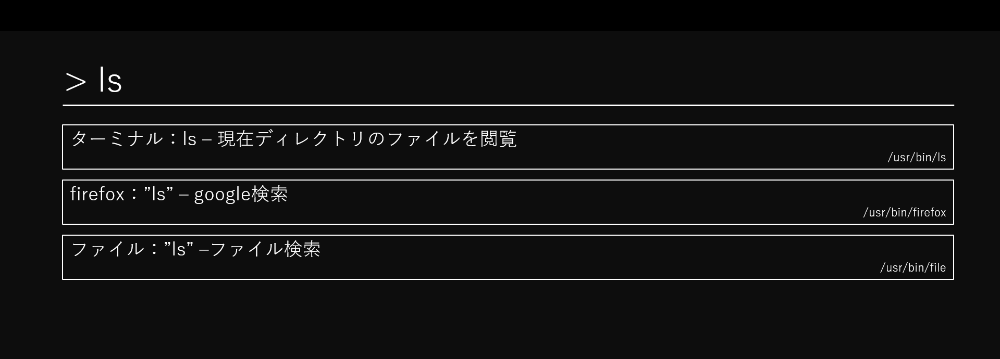
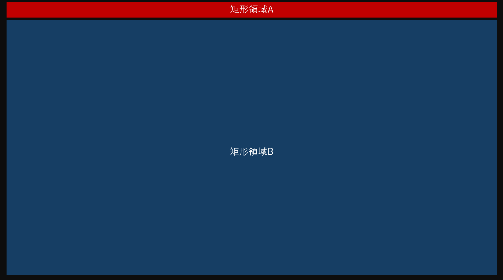
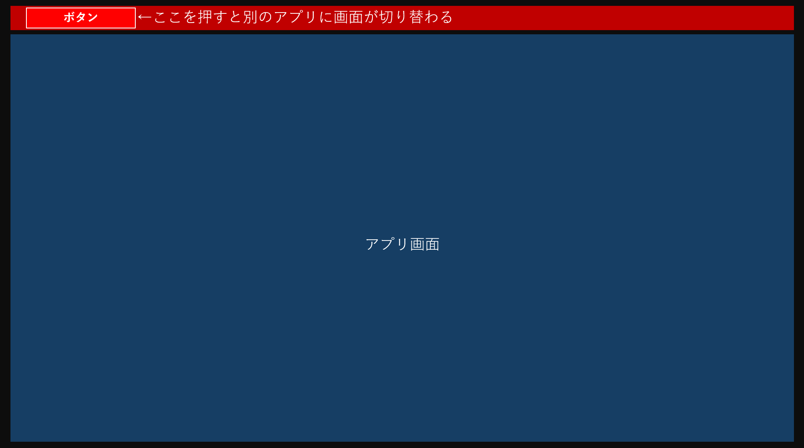

# 要件定義
まずDE環境側で統一するUIを決めなければいけません．
そこで統一するためにはいくつかの制約が必要になってきます．
一つ一つ確認していきましょう．

## 矩形配置
多くのGUIアプリはウィンドウという矩形を操作して，
モニタに映るユーザー空間に出力しています．

果たして動的なウィンドウ配置は必要なのか

我々は日々当たり前のようにウィンドウを
マウスによるドラックによって移動し，
ウィンドウの配置を決定していますが
それは本当に美しいでしょうか？
.png)
写真7：左にエディタ，右にブラウザ *= O(n)

そうです．決まったウィンドウ配置に決めたら
アプリを操作するだけなのでウィンドウ操作は
本質的に不要な操作と言えそうです．

## じゃあ何を使ってウィンドウ配置を決めるのか？

コマンドです．
```bash
wm $ウィンドウのサイズ | 開くアプリケーション
```
メリットとしては
・他プログラムから簡単に呼び出せる
・動的配置が無くなるので軽い

## GUI考えてるのにCLIじゃねぇか問題
おっしゃる通りです．
しかし，UNIX系列のCLIは"一度覚えてしまえば"
とても簡単なことが多いです

さらに，日々私たちは何気にコマンドをほぼ毎日叩いています

写真8：みんな大好きGoogle

そう彼はGUIのふりをしながら我々の見えないところで
grepしているだけに過ぎないのです．
このようなことからCLI自体が
さほど使いにくいというわけではないということがわかります．

## GCIという発想
上記の発想から以下の着想に変わります

**GCI**(Glaphics Command Interface)

そうです．コマンド自体をわかりやすくすればいいのです．

写真9：ちょっとわかりやすい気がしませんか？

つまるところGUIで誤魔化すのではなく，
CLIそのものをわかりやすく出来るのです．

## GUIをコマンドで操作することによる恩恵
実例を考えていきましょう．
試しに矩形領域A,Bについて考えていきましょう．

写真10：二つの領域

まずは領域Bにアプリを開いてもらいます
```bash
wm $領域B | 何かのアプリ
```

次に領域Aで少し高度なことをします．
領域Bに対して別のアプリを開かせるGUIを，
Web言語で実装できたとしましょう．
```js
//提供：ChatGPT
document.getElementById("openApp").addEventListener("click", () => {
    fetch("/run?cmd=wm $領域B | 別のアプリ");
});
```
このアプリを実行すると...
```bash
wm $領域Ａ| 切り替えアプリ
```

写真11：これは...!

なんとタブ機能がごく簡単に実装できました．

これをスクリプト１本にまとめると...
```bash
#tabwindow.sh
wm $領域Ａ| 切り替えアプリ
wm $領域B | 何かのアプリ
```
そのままGithubに持っていくことができます．
pyでスクリプトを組むなり，
Web言語でＧＵＩを拡張してもいいかもしれません．

### ここまでのまとめ
- winのGUI使いにくい
- LinuxでのDE環境を考える
- GUIをテキストベースで作れる

一つのツールをうまく動かすUNIXらしい要件定義ができました．
自分が実装したいものを忘れないように，
具体的に書き落とせたのはとても大きいと思います．
作りたいものがある程度決まったので，
あとは実装が残るのみになるでしょう．

実装に向けて必要なツールについて選定する

[設計](./設計書.md)

