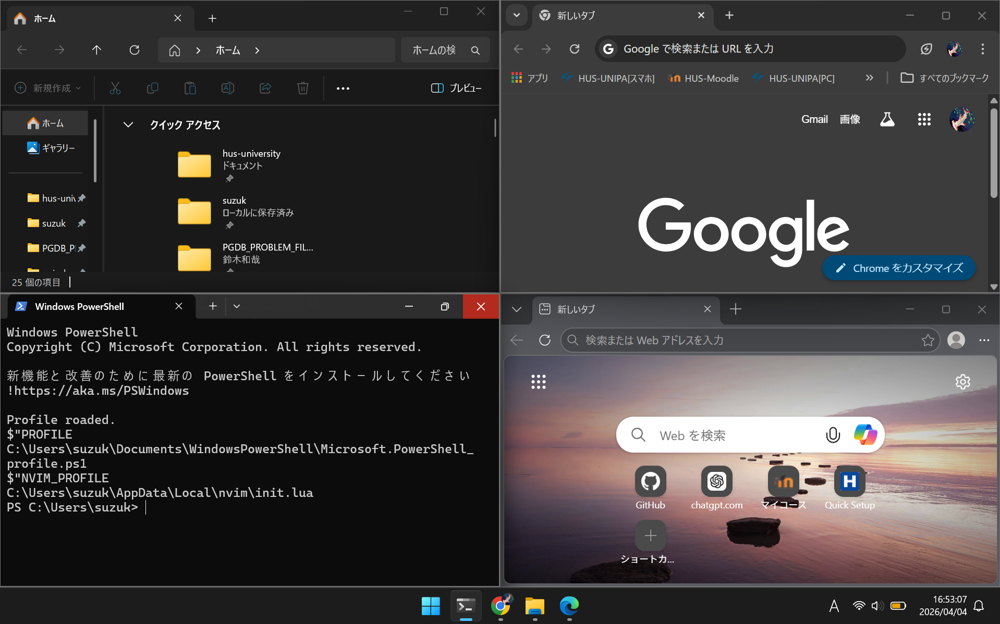
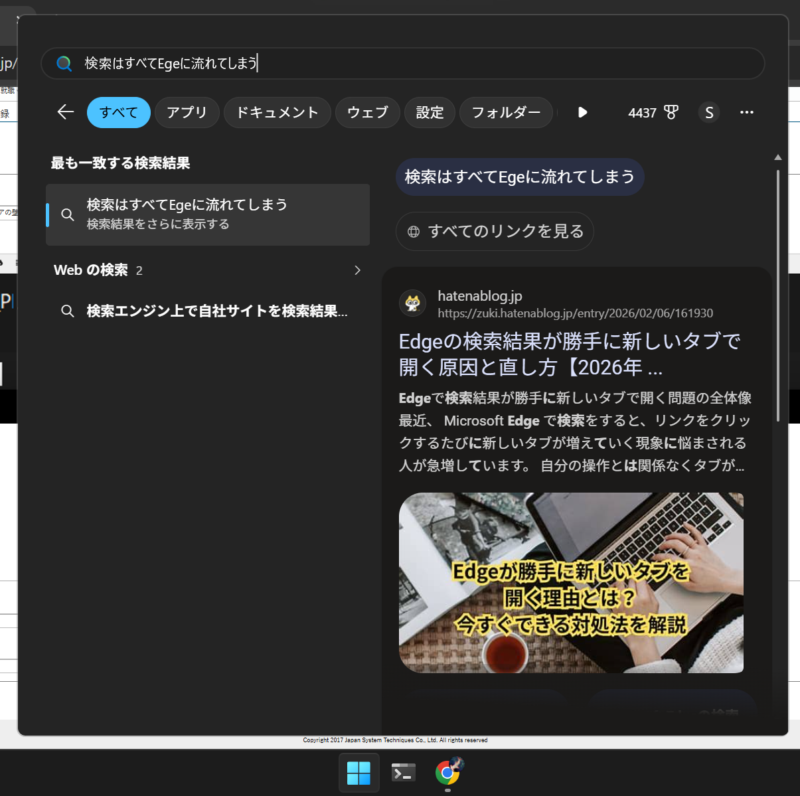
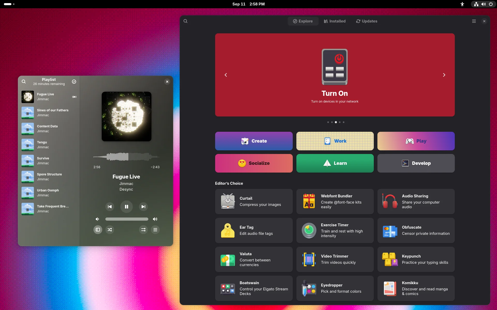
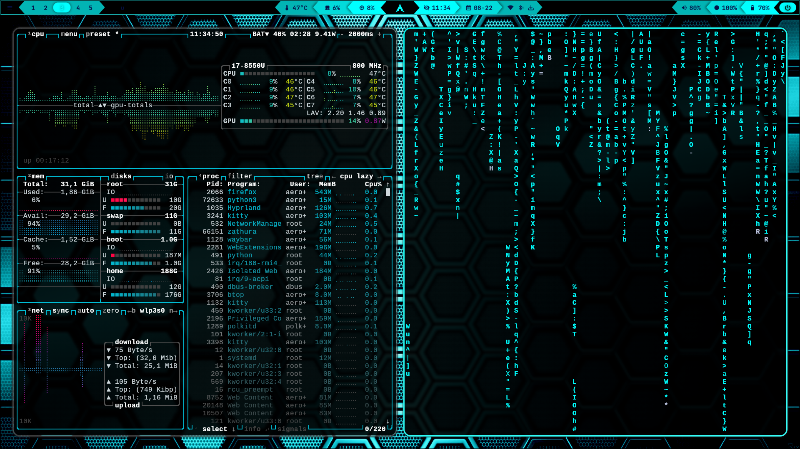

# 現在開発中のソフトについて
## はじめに
自分が現在行ってる開発工程を忘れないように備忘録として残しつつ、どのようなものを開発しているのかを教授方をはじめとする第三者に共有する目的でここに書き残しておきます。大学生活全体を通して一貫した自分の行動の動機でもあるので暇な時間にでも読んでくれると泣いて喜びます。

## 自分が今取り組んでいるもの
- デスクトップ環境をLinuxで制作する

...順に経緯を説明しましょう．

現行のWindowsアプリはGUIでの操作を基本としているが，その操作に対してはいくつかの不満があります．

### アプリによって隔絶されたUI
見てもらう方が早い気がします．

写真1：すべて同じタブとしての機能．そして検索バー．

ほかにもあります


写真2：編集ソフトでおなじみのツールバー

これらUIにもあるとおり大半のソフトのUIは決まっています．
しかし，アプリによってそれらUIの互換は分断され結果として使いにくい状態になっていると考えることができるでしょう．写真３：例えばこんな風にしたい

### スタートメニューの検索がEdge固定

写真3：憎きUI

一番の拡張性があるsuperキー(winキー)を誰も存在を知らないであろう機能に押し上げているMSは凄い．

## Linuxによるデスクトップ環境の可能性
最近のLinuxディストリビューションでは，
個人での実用に耐えうるデスクトップ(以下DE)環境が用意されています．

写真4：GNOMEデスクトップ．動作の安定性やデザイン性が高く人気．


写真5：hyprlandデスクトップ．アニメーションも拡張性もトップクラスで壊れやすい・難しいこと以外はトップレベル．


写真6：i3デスクトップ．とにかく軽量で無骨．スペックの低いPCでも動作しやすい．

...そこでアプリ間で隔絶されてしまうUIをLinuxDE側で統一はできないかと試みるわけです．

## linuxでDE環境を作るには
かなりめんどくさいですが頑張ります．

### 要件定義
まずDE環境側で統一するUIを決めなければいけません．
そこで統一するためにはいくつかの制約が必要になってきます．
一つ一つ確認していきましょう．

### 矩形配置
多くのGUIアプリはウィンドウという矩形を操作して，
モニタに映るユーザー空間に出力しています．

果たして動的なウィンドウ配置は必要なのか

我々は日々当たり前のようにウィンドウを
マウスによるドラックによって移動し，
ウィンドウの配置を決定していますが
それは本当に美しいでしょうか？
.png)
写真7：左にエディタ，右にブラウザ *= O(n)

そうです．決まったウィンドウ配置に決めたら
アプリを操作するだけなのでウィンドウ操作は
本質的に不要な操作と言えそうです．

### じゃあ何を使ってウィンドウ配置を決めるのか？

コマンドです．
```bash
wm $ウィンドウのサイズ | 開くアプリケーション
```
メリットとしては
・他プログラムから簡単に呼び出せる
・動的配置が無くなるので軽い

### GUI考えてるのにCLIじゃねぇか問題
おっしゃる通りです．
しかし，UNIX系列のCLIは"一度覚えてしまえば"
とても簡単なことが多いです

さらに，日々私たちは何気にコマンドをほぼ毎日叩いています

写真8：みんな大好きGoogle

そう彼はGUIのふりをしながら我々の見えないところで
grepしているだけに過ぎないのです．
このようなことからCLI自体が
さほど使いにくいというわけではないということがわかります．

### GCIという発想
上記の発想から以下の着想に変わります

**GCI**(Glaphics Command Interface)

そうです．コマンド自体をわかりやすくすればいいのです．

写真9：ちょっとわかりやすい気がしませんか？

つまるところGUIで誤魔化すのではなく，
CLIそのものをわかりやすく出来るのです．

### GUIをコマンドで操作することによる恩恵
実例を考えていきましょう．
試しに矩形領域A,Bについて考えていきましょう．

写真10：二つの領域

まずは領域Bにアプリを開いてもらいます
```bash
wm $領域B | 何かのアプリ
```

次に領域Aで少し高度なことをします．
領域Bに対して別のアプリを開かせるGUIを，
Web言語で実装できたとしましょう．
```js
//提供：ChatGPT
document.getElementById("openApp").addEventListener("click", () => {
    fetch("/run?cmd=wm $領域B | 別のアプリ");
});
```
このアプリを実行すると...
```bash
wm $領域Ａ| 切り替えアプリ
```

写真11：これは...!

なんとタブ機能がごく簡単に実装できました．

これをスクリプト１本にまとめると...
```bash
#tabwindow.sh
wm $領域Ａ| 切り替えアプリ
wm $領域B | 何かのアプリ
```
そのままGithubに持っていくことができます．
pyでスクリプトを組むなり，
Web言語でＧＵＩを拡張してもいいかもしれません．

### ここまでのまとめ
- winのGUI使いにくい
- LinuxでのDE環境を考える
- GUIをテキストベースで作れる

一つのツールをうまく動かすUNIXらしい要件定義ができました．
自分が実装したいものを忘れないように，
具体的に書き落とせたのはとても大きいと思います．
作りたいものがある程度決まったので，
あとは実装が残るのみになるでしょう．

実装に向けて必要なツールについて選定する

[設計](./設計書.md)
